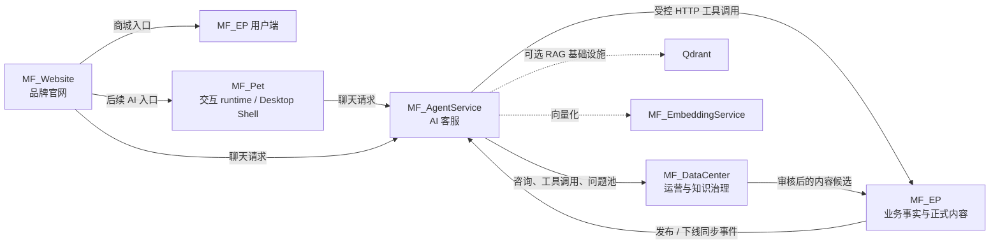

# MF Project

> 苗丰智能农业应用生态：将农业电商、智能客服、数据治理、品牌官网与人格化交互入口组合为可独立演进的多服务系统。

MF Project 面向苗木、肥料、种植知识和咨询服务场景。项目以 `MF_EP` 提供业务事实和正式内容，以 `MF_AgentService` 编排 AI 客服与受控工具调用，以 `MF_DataCenter` 沉淀咨询数据、治理知识候选和运营指标；`MF_Website` 与 `MF_Pet` 负责面向用户的品牌与交互入口。

## 核心能力

- 农业电商：用户、商品、购物车、订单、商家、百科、内容与运营后台。
- AI 客服：种植咨询、商品查询、百科问答、订单状态解释、商家入驻咨询，以及 HTTP / SSE 接口。
- 受控业务调用：Agent 通过 API 和工具查询业务事实，不直接访问 MF_EP 或 DataCenter 数据库。
- 数据与知识治理：咨询记录、工具调用、未解决问题、样本候选、指标字典、数据质量规则和源表契约。
- 内容同步：正式内容发布后，以同步事件驱动 Agent 检索侧更新；消费、失败与确认状态可审计。
- 多端体验：商城用户端、商家端、运营数据中台、品牌官网、Web 宠物 runtime 与 Electron 桌面壳。

## 架构



### 服务边界

| 模块 | 主要职责 | 不负责的事情 |
| --- | --- | --- |
| `MF_EP` | 商品、订单、用户、商家、百科、内容等业务事实；正式内容发布权 | AI 编排和数据中台运营 |
| `MF_AgentService` | 客服编排、会话、受控工具调用、RAG / LLM 适配、知识同步消费 | 直接读写其他服务数据库 |
| `MF_DataCenter` | 运营看板、咨询沉淀、问题池、样本审核、指标和质量治理 | 修改 MF_EP 的订单、商品、用户、商家业务流程 |
| `MF_Website` | 品牌展示、商城入口、后续 AI 交互入口 | 保存商城业务数据或内部密钥 |
| `MF_Pet` | 宠物状态机、主题资源、Web 交互和 Electron 桌面壳 | 充当业务系统或 AI 服务端 |

## 技术栈

| 领域 | 技术 |
| --- | --- |
| 后端 | Java 17, Spring Boot, Spring MVC, Spring Validation, Actuator, Maven 多模块 |
| 数据 | MySQL, MyBatis-Plus, Redis, Flyway, JSON fallback |
| AI 应用 | Spring AI, Tool Calling, 轻量 RAG, SSE, 关键词 / 向量检索同步 |
| 前端 | Vue 3, Vite, Element Plus, Pinia, Vue Router, Axios, ECharts |
| 品牌与交互 | 原生 JavaScript, GSAP, ScrollTrigger, Lenis, Electron |
| 可选 RAG 基础设施 | Qdrant, FastAPI, sentence-transformers (`BAAI/bge-m3`) |
| 工程化 | PowerShell 本地启动脚本、端口复核、健康检查、环境变量配置 |

## 仓库结构

```text
MF_Project/
├── MF_EP/                 # 电商业务系统：Java 后端 + 管理端 / 用户端 / 商家端
├── MF_AgentService/       # 模块化 AI 客服：contract / core / integrations / app
├── MF_DataCenter/         # 运营与知识治理中台：Spring Boot + Vue 3
├── MF_Website/            # 品牌官网：Vite + GSAP + Lenis
├── MF_Pet/                # Web 宠物 runtime、素材与 Electron 桌面壳
├── MF_EmbeddingService/   # FastAPI 向量化服务
├── MF_Game/               # 独立游戏 / 互动实验模块
├── MF_Logo/               # 品牌资源
├── scripts/               # 本地启动、停止、端口检查脚本
└── docker-compose.rag.yml # 可选 Qdrant + Embedding RAG 基础设施
```

## 关键模块

### MF_EP

核心电商业务系统。后端为 Maven 聚合工程：

```text
fertilizer-common  # 实体、DTO、VO、通用返回、JWT 与工具类
fertilizer-core    # Mapper、Service 与业务逻辑
fertilizer-api     # Controller、配置、鉴权、运行入口
```

前端包含管理端、用户端与商家端。接口按 `/admin/**`、`/client/**` 和商家侧职责划分，使用 JWT 与 Redis 管理认证状态。

### MF_AgentService

模块化单体，而非过早拆分的微服务：

```text
customer-agent-app
        ├── agent-core
        └── agent-integrations
                 └── agent-contract
```

- `agent-contract`：聊天 DTO、工具结果与受控端口接口。
- `agent-core`：客服编排、意图与回答策略、会话和降级逻辑。
- `agent-integrations`：MF_EP、DataCenter、RAG、LLM 与工具适配。
- `customer-agent-app`：Spring Boot 启动模块、HTTP / SSE 接口和运行配置。

当前主要接口：`POST /api/agent/chat`、`POST /api/agent/chat/stream`，服务端口为 `8092`。

### MF_DataCenter

数据中台独立沉淀 AI 运营数据，并以只读原则对接后续业务数据分析：

- AI 咨询日志、Agent 工具调用日志、未解决问题、样本候选支持持久化。
- 运营总览、AI 分析、指标字典、数据质量、源表契约等接口和页面已具备 V1 能力。
- V1 的部分用户、商品、订单、GMV、商家分析仍是 mock 聚合数据，不能视为实时生产经营报表。

默认端口：API `8091`，前端 `5176`。

### MF_Website 与 MF_Pet

`MF_Website` 使用 Vite、GSAP、ScrollTrigger 和 Lenis 构建沉浸式品牌官网，并提供商城入口与 Pet 适配层。`MF_Pet` 提供状态机驱动的 Web runtime、主题资源体系、聊天气泡、拖拽 / mini 模式，以及轻量 Electron 桌面壳。

## 内容与知识同步

正式内容以 MF_EP 为唯一事实源。典型治理链路如下：

```text
DataCenter 样本候选
  -> 知识草稿与审核
  -> MF_EP 正式内容审核 / 发布 / 下线
  -> 写入待消费同步事件
  -> AgentService 消费事件并刷新检索侧
  -> 成功确认或失败 / 超时审计
```

该链路采用可重试、可审计的最终一致性模型。它处于 V1 集成阶段：发布、同步、命中、下线失效、回滚与自动化仍应在目标环境中进行完整验收。

## 本地运行

### 前置条件

- JDK 17+
- Maven 3.9+
- Node.js 18+
- MySQL 8+
- Redis（MF_EP 本地依赖时）
- Docker Desktop（仅在启用可选 Qdrant / Embedding RAG 基础设施时需要）

所有密码、内部 Token、数据库连接和模型密钥均通过 Windows 用户环境变量或部署平台密钥管理注入。不要把真实值写入 Git、YAML、脚本、日志或 README。

### 1. 检查端口

```powershell
cd F:\20260518-xiangmu\MF_Project
.\scripts\check-mf-ports.ps1
```

### 2. 启动可选 RAG 基础设施

```powershell
docker compose -f docker-compose.rag.yml up -d --build
```

该命令启动：

- Qdrant：`http://127.0.0.1:6333`
- MF Embedding Service：`http://127.0.0.1:8000/health`

### 3. 启动核心本地集成栈

根启动脚本会检查 Windows 用户环境变量、MySQL、Redis、服务端口和健康接口。首次构建 DataCenter 包时：

```powershell
.\scripts\start-mf-prod-local.ps1 -PackageDataCenter
```

重启现有核心栈时：

```powershell
.\scripts\start-mf-prod-local.ps1 -Restart
```

该脚本需要管理员确认，并会启动 MF_EP API、DataCenter API、AgentService、MF_EP 用户端和 DataCenter 前端。MF_EP 管理端与商家端可按需增加参数：

```powershell
.\scripts\start-mf-prod-local.ps1 -WithEpAdmin -WithEpMerchant
```

### 4. 启动官网与 Pet

官网：

```powershell
cd MF_Website\mf_Website
npm install
npm run dev -- --host 127.0.0.1 --port 5178
```

Pet Web demo：

```powershell
cd MF_Pet
python -m http.server 5179
```

Pet Electron 桌面壳：

```powershell
cd MF_Pet
npm run desktop
```

## 本地端口

| 服务 | 端口 | 地址 / 说明 |
| --- | ---: | --- |
| MF_EP 管理端 | 5173 | 管理后台 |
| MF_EP 用户端 | 5174 | 商城用户端 |
| MF_EP 商家端 | 5175 | 商家后台 |
| MF_DataCenter Web | 5176 | 运营数据中台 |
| MF_Website | 5178 | 品牌官网 |
| MF_Pet Demo | 5179 | 静态 Web demo |
| MF_EP API | 8080 | `GET /actuator/health` |
| MF_DataCenter API | 8091 | `GET /api/system/status` |
| MF_AgentService | 8092 | `GET /actuator/health` |

## 验证

各模块应独立验证，避免一次构建掩盖失败来源：

```powershell
# AI 客服模块化工程
cd MF_AgentService
mvn test

# DataCenter API
cd ..\MF_DataCenter\datacenter-api
mvn test

# DataCenter Web
cd ..\datacenter-web
npm run build

# 官网
cd ..\..\MF_Website\mf_Website
npm run build
```

对于跨服务能力，除构建和单元测试外，还应验证发布、同步、检索命中、下线失效和失败重试等真实链路。

## 安全与边界

- AI 服务只能通过受控 API / 工具读取业务事实；订单查询等敏感场景必须携带用户身份上下文。
- MF_DataCenter 不直接修改 MF_EP 核心业务数据。
- `VITE_*` 变量只能存放公开 URL 等前端可见配置，严禁存放密码、内部 Token 或模型 API Key。
- 内部 Token、数据库密码和模型密钥必须从安全环境变量或部署平台密钥管理中读取。
- 正式部署前应轮换曾在日志、截图或对话中暴露过的凭据，并设置最小权限与审计机制。

## 当前状态与演进

项目已具备可独立启动的核心服务、AI 客服编排、DataCenter 治理能力、可选 RAG 基础设施及多端入口。当前重点是将 V1 的跨服务闭环在真实目标环境中持续验收和自动化：

1. 发布内容并可靠生成同步事件。
2. AgentService 幂等消费、刷新检索侧并确认结果。
3. 验证检索命中、内容下线失效、失败重试与回滚。
4. 完善生产可观测性、告警、部署自动化与权限治理。

## 开发约定

- 每个服务只管理自己的端口和进程，不按 `java`、`node` 或 `mvn` 进程名进行批量停止。
- 变更业务接口时同步维护调用方、测试和相应模块文档。
- 对跨服务发布路径，先验证 MF_EP 的数据库结构和接口契约，再判断消费端逻辑。
- 提交前执行与变更范围相符的测试或构建，并避免提交构建产物、日志、运行数据与密钥。

## License

当前仓库未声明开源许可证。使用、复制或分发前请先与仓库维护者确认授权范围。
